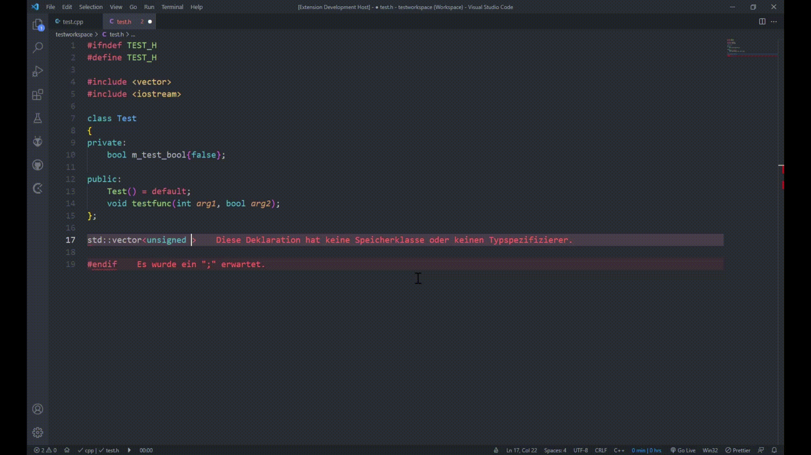

# C/C++ Definition Autocompletion

**Autocomplete function definitions from already declared function signatures.**

 

## Features

To trigger the autocompletion, type a `.` on a new blank line in your `.c/.cpp` file:

 

The extension will parse every header file in your project in provides definition completion suggestions in the associated source file.

 

## Requirements

- C/C++ Extension

 

## Extension Settings

This extension contributes the following settings:

* `definition-autocompletion.trigger_character`: The character that triggers the completion suggestion on a new blank line.
* `definition-autocompletion.update_index_on_save`: Wether to update the symbol index table on save.
* `definition-autocompletion.update_index_on_change`: Wether to update the symbol index table when changing the active text editor

 

## Known Issues

There are no known issues.

 

## Future Plans

- support templates
- automatically add class specifier to class member function definitions
- only show these who are not already defined yet

 

## Release Notes

### 1.0.0

 - Initial release

