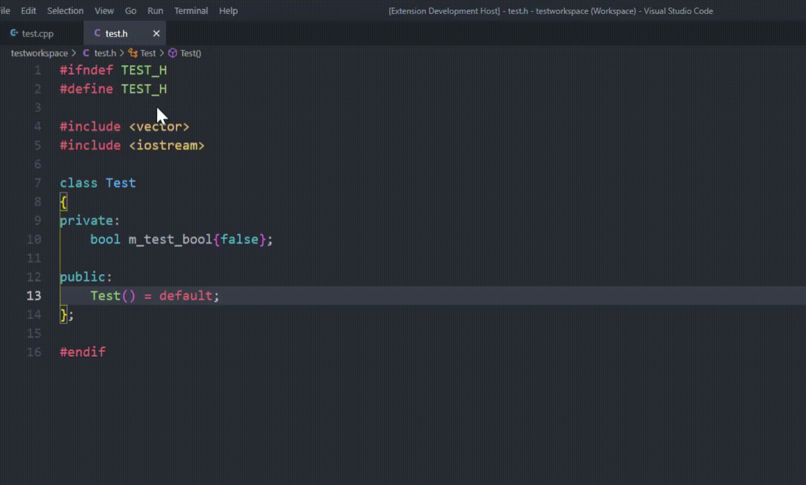
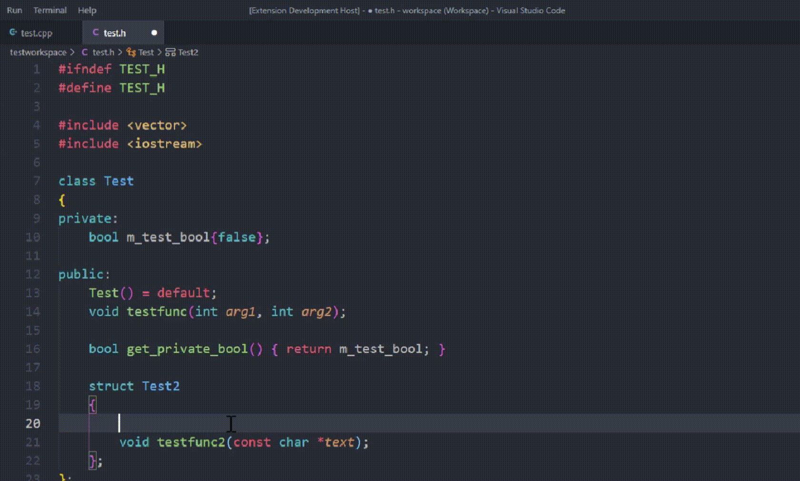

# C/C++ Definition Autocompletion

**Autocomplete function definitions from declared functions on the fly.**

 

## Features
-----------

To trigger the autocompletion, type a `.` on a new blank line in your `.c/.cpp` file.

### **Currently we are supporting:**
- member class functions
- normal functions
- template functions
- nested member class functions
- and many more...

### **Additional Features:**
- only functions which are not defined already are suggested
- special handling of constructors to quickly have a member initializer list on hands
- inlined / deleted / defaulted / pure virtual functions are not suggested

  

## Examples:
-----------

 

## Requirements
---------------

- C/C++ Extension

 

## Extension Settings
---------------------

This extension contributes the following settings:

* `definition-autocompletion.trigger_character`: The character that triggers the completion suggestion on a new blank line.
* `definition-autocompletion.update_index_on_save`: Wether to update the symbol index table when saving the current text document.
* `definition-autocompletion.update_index_on_change`: Wether to update the symbol index table when changing the active text editor

 

## Known Issues
---------------

- When trigger the suggestion on a file not parsed yet, the function definition right after the triggerCharacter is not parsed correctly.
- nested return Types are not extended by the outer layer Type

 

## Future Plans
---------------

- fix issues

 

## Release Notes
----------------

### 1.1.2

  - detect more function attributes and specifiers correctly

### 1.1.1

  - supporting constructors member initialization list

### 1.1.0

 - supporting templates
 - supporting inline functions
 - supporting nested class members

### 1.0.0

 - Initial release

