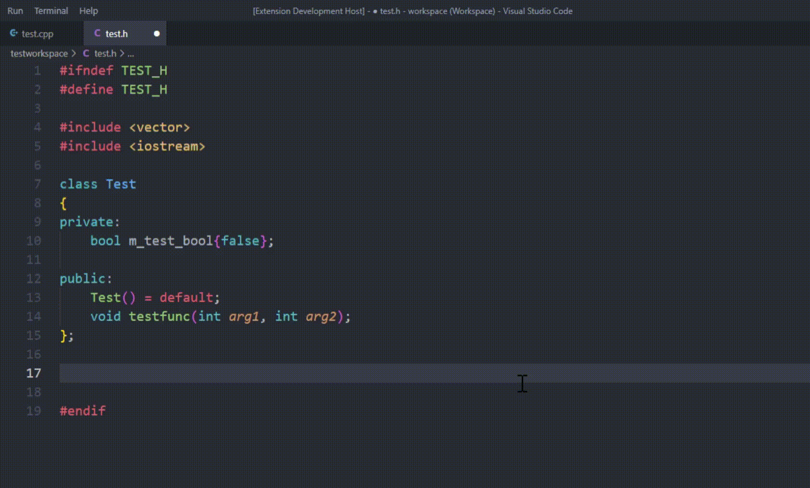

# C/C++ Definition Autocompletion

**Autocomplete function definitions from already declared function signatures.**

 

## Features
-----------

To trigger the autocompletion, type a `.` on a new blank line in your `.c/.cpp` file.

 

### **Support for member class functions:**

 

### **As well as normal functions:**

Only function declarations with no function definition are suggested.

 

## Requirements
---------------

- C/C++ Extension

 

## Extension Settings
---------------------

This extension contributes the following settings:

* `definition-autocompletion.trigger_character`: The character that triggers the completion suggestion on a new blank line.
* `definition-autocompletion.update_index_on_save`: Wether to update the symbol index table on save.
* `definition-autocompletion.update_index_on_change`: Wether to update the symbol index table when changing the active text editor

 

## Known Issues
---------------

- When trigger the suggestion on a file not parsed yet, the function definition right after the triggerCharacter is not parsed correctly.

 

## Future Plans
---------------

- support templates
- fix issues

 

## Release Notes
----------------

### 1.0.0

 - Initial release

